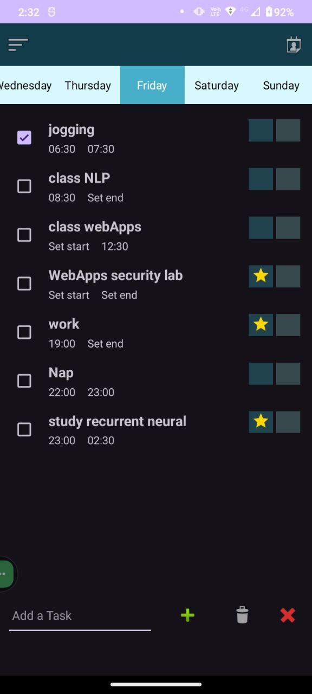
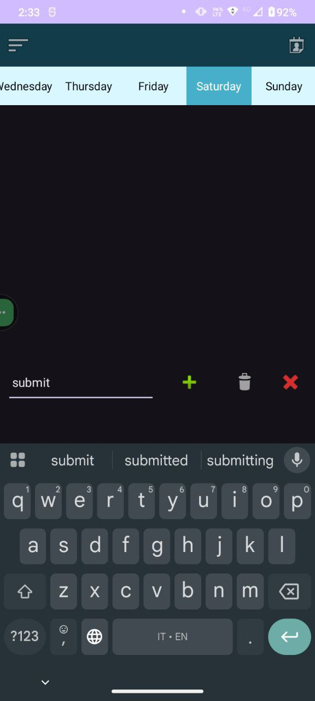
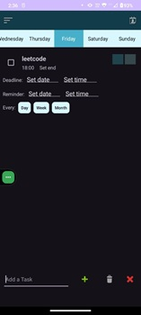

# MyTasker - Minimalist Task Manager 📝

## Why MyTasker Exists

I created this app for personal use after failing to find a lightweight, non-complex task manager. As a good friend wisely observed:

> "Most task management tools miss the core purpose - they end up wasting your time instead of saving it."

MyTasker cuts through the clutter:
- Insert tasks in seconds
- Mark importance with one tap
- Edit details later *only if needed*
- Get intelligent notifications

## Key Features ⚡

### Dead-Simple Workflow
 **Add task (title only required)**

**daily, weekly, monthly repeated tasks marking**

### Smart Notifications 🔔
- Reminder alerts
- Deadline warnings
- 8-minute pre-task alerts *(configurable)*

### Flexible Organization
- Filter important/urgent tasks
- Sort by:
    - Creation time (default)
    - Deadline
    - Reminder time
    - Custom priorities

## Technical Notes ⚙️

### Built With
- Kotlin (My first Kotlin project!)
- Android Jetpack Components
- Material Design 3

### Design Philosophy
- **Minimalist UI**: No unnecessary clicks
- **Zero Optimizations**: Intentional choice - the app is designed for sub-1-minute interactions
- **Personal First**: Built exactly how *I* work

## Getting Started

### Installation
1. Clone repository
2. Open in Android Studio
3. Build & run on device/emulator

### Usage Tips
- Long-press tasks for quick actions
- Swipe left to delete
- Blue border = important task

## Why You Might Like This
✔️ No feature bloat  
✔️ No mandatory fields  
✔️ No cognitive load  
✔️ Gets out of your way

## Disclaimer
This app was created to solve *my specific workflow needs*. The notification logic isn't exhaustive, but it works perfectly for how I use it. Feel free to fork and adapt it to your own rhythm!

---

*"if productivity apps demand more attention than your actual work, they've failed."*
- MyTasker Philosophy